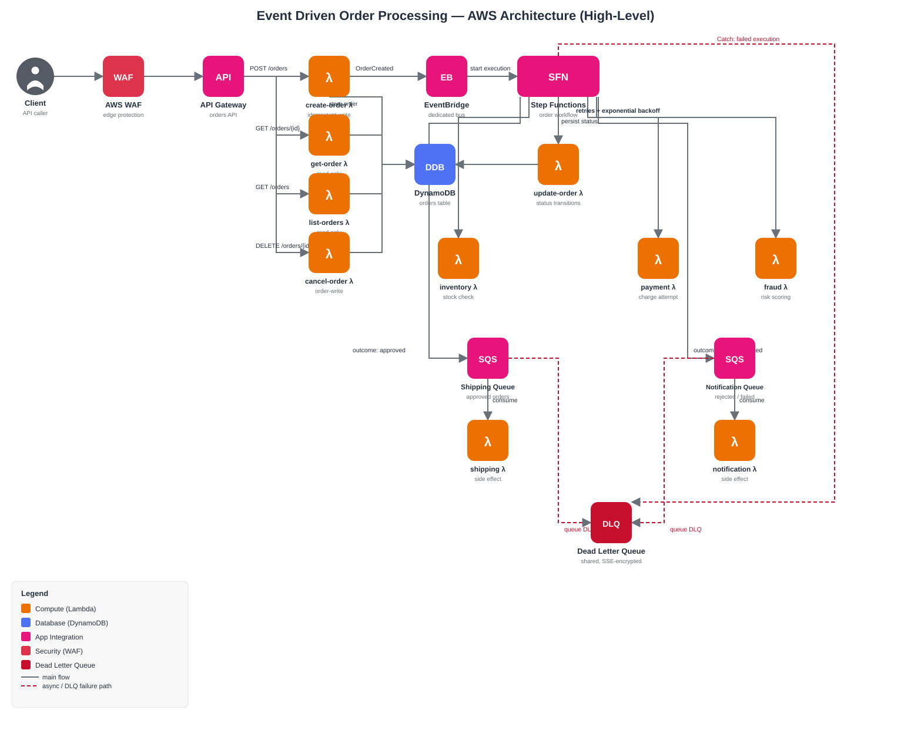
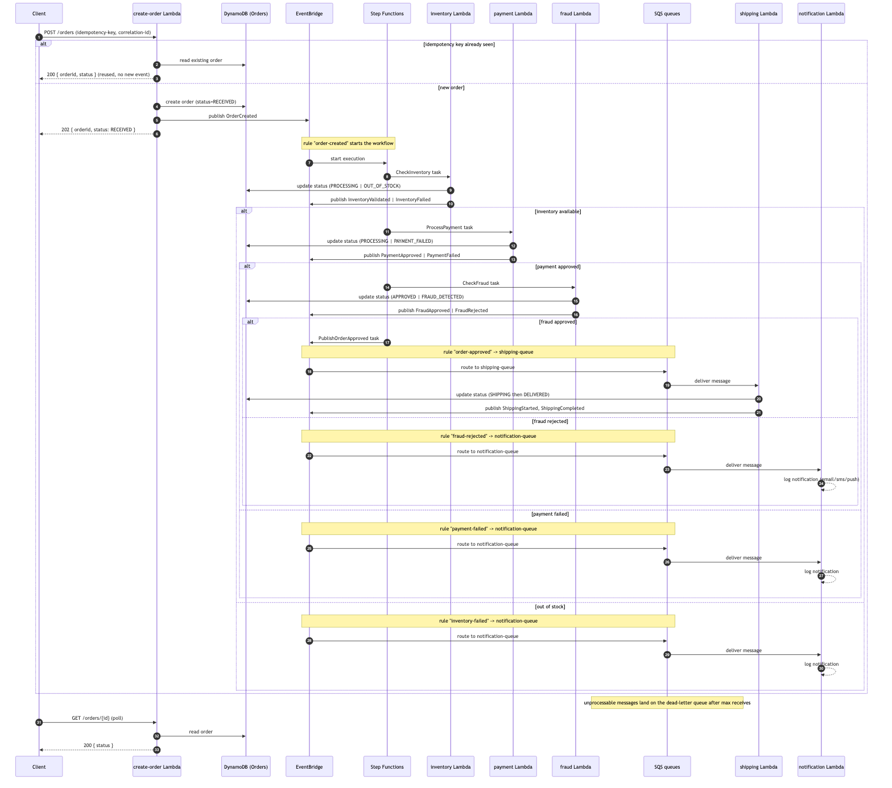
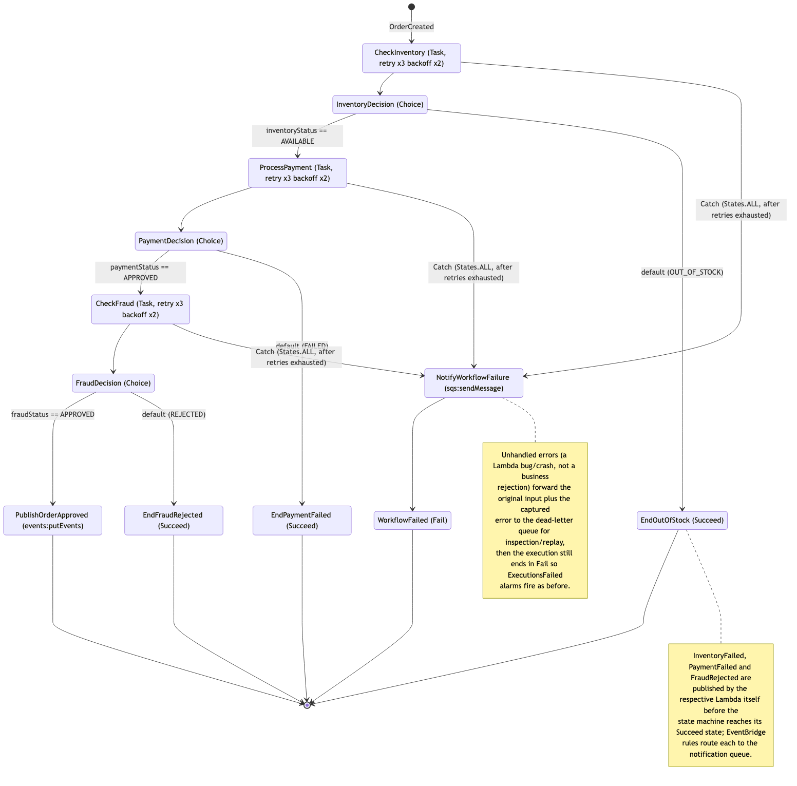
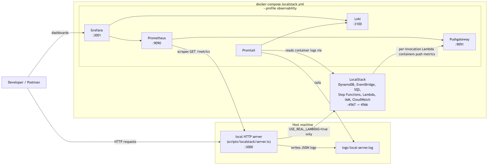

# Event Driven Order Processing

## Overview

The project exposes an orders API backed by API Gateway, WAF, Lambda, DynamoDB, EventBridge, Step Functions, SQS and CloudWatch. It is designed as a portfolio-ready codebase that demonstrates:

- Node.js 22 with TypeScript strict mode
- Event-driven orchestration with EventBridge and Step Functions
- Structured logging and correlation ID propagation
- Idempotent order creation
- Modular Terraform infrastructure
- Automated quality gates with GitHub Actions

## Architecture

Main flow:

1. Client sends `POST /orders`.
2. WAF protects the API Gateway endpoint.
3. `create-order` Lambda validates input, enforces idempotency, stores the order and publishes `OrderCreated`.
4. EventBridge starts the Step Functions workflow.
5. Step Functions orchestrates `inventory`, `payment` and `fraud` Lambdas with retries and exponential backoff.
6. Outcome events fan out to SQS queues.
7. `shipping` or `notification` Lambdas complete the asynchronous side effects.
8. CloudWatch dashboards and alarms provide observability.



Diagram sources (Mermaid) live in [`docs/mmd`](docs/mmd) and render as images in [`docs/img`](docs/img):

- [`architecture.mmd`](docs/mmd/architecture.mmd) — component view above.
- [`order-flow.mmd`](docs/mmd/order-flow.mmd) — sequence diagram of a request through create, workflow and delivery.
- [`step-functions-flow.mmd`](docs/mmd/step-functions-flow.mmd) — the exact state machine defined in
  `terraform/environments/dev/order-processing.asl.json.tpl`.
- [`local-dev-topology.mmd`](docs/mmd/local-dev-topology.mmd) — local Docker Compose/observability topology (see
  [Local observability stack](#local-observability-stack-grafana-prometheus-pushgateway-loki)).

<details>
<summary>Order flow (sequence diagram)</summary>



</details>

<details>
<summary>Step Functions workflow (state diagram)</summary>



</details>

## Project structure

```text
terraform/
  modules/
  environments/
src/
  shared/
  create-order/
  inventory/
  payment/
  fraud/
  shipping/
  notification/
  update-order/
  orders/
tests/
.github/workflows/
docs/
```

## API

### Create order

`POST /orders`

```json
{
  "customerId": "123",
  "items": [
    {
      "productId": "ABC",
      "quantity": 2
    }
  ]
}
```

Response:

```json
{
  "orderId": "uuid",
  "status": "RECEIVED"
}
```

### Get order

`GET /orders/{id}`

### List orders

`GET /orders`

### Cancel order

`DELETE /orders/{id}`

## Domain statuses

- `RECEIVED`
- `PROCESSING`
- `APPROVED`
- `REJECTED`
- `OUT_OF_STOCK`
- `PAYMENT_FAILED`
- `FRAUD_DETECTED`
- `SHIPPING`
- `DELIVERED`
- `CANCELLED`

## Event catalog

- `OrderCreated`
- `InventoryValidated`
- `InventoryFailed`
- `PaymentApproved`
- `PaymentFailed`
- `FraudApproved`
- `FraudRejected`
- `OrderApproved`
- `ShippingStarted`
- `ShippingCompleted`

All events use source `order.processing`, version `v1` and carry a correlation ID.

## Local development

Prerequisites:

- Node.js 22+
- npm 10+
- Terraform 1.9+
- Docker

Install dependencies:

```bash
npm install
```

### Environment variables

Local scripts (`scripts/localstack/bootstrap.ts`, `local:start`) set most of these automatically; override only when
you need non-default behavior. In deployed environments, Terraform sets `ORDERS_TABLE_NAME` and `EVENT_BUS_NAME` on
each Lambda.

| Variable                                          | Default                                            | Purpose                                                                                                                                        |
| ------------------------------------------------- | -------------------------------------------------- | ---------------------------------------------------------------------------------------------------------------------------------------------- |
| `ORDERS_TABLE_NAME`                               | _(required)_                                       | DynamoDB Orders table name.                                                                                                                    |
| `EVENT_BUS_NAME`                                  | _(required)_                                       | EventBridge bus name.                                                                                                                          |
| `FEATURE_INVENTORY_CHECK` / `FEATURE_FRAUD_CHECK` | `true`                                             | Set to `false` to bypass the inventory/fraud business rule for that step.                                                                      |
| `USE_LOCALSTACK` / `LOCAL_AWS_ENDPOINT`           | unset (real AWS)                                   | Routes the AWS SDK clients at a local endpoint; `local:bootstrap` sets both.                                                                   |
| `AWS_REGION`                                      | `us-east-1`                                        | Region used by the AWS SDK clients.                                                                                                            |
| `PORT`                                            | `3000`                                             | Port for the local HTTP API (`scripts/localstack/server.ts`).                                                                                  |
| `USE_REAL_LAMBDAS`                                | `false`                                            | Local server invokes real bundled Lambda handlers deployed in LocalStack instead of calling use cases directly.                                |
| `PUSHGATEWAY_URL`                                 | unset (metrics push off)                           | Pushgateway endpoint for per-invocation Lambda metrics (`USE_REAL_LAMBDAS=true` runs).                                                         |
| `LOG_FILE_PATH`                                   | unset (`local:start` sets `logs/local-server.log`) | Additional file the structured logger appends JSON log lines to.                                                                               |
| `LAMBDA_INTERNAL_AWS_ENDPOINT`                    | `http://localstack:4566`                           | LocalStack endpoint used by real Lambda containers on the Docker network (`deploy-lambdas.ts`), vs. `LOCAL_AWS_ENDPOINT` for the host process. |
| `PUSHGATEWAY_INTERNAL_URL`                        | `http://pushgateway:9091`                          | Pushgateway endpoint on the Docker network, set on real Lambda containers so they can push metrics.                                            |
| `LOCALSTACK_RESOURCE_PREFIX`                      | unset (default prefix)                             | Overrides the name prefix used for bootstrapped LocalStack resources (`bootstrap.ts`).                                                         |

## One-command local workflow

This repository includes a shell script to run the complete local workflow:

```bash
./local.sh help
```

Available commands:

- `./local.sh up`: starts LocalStack and bootstraps local AWS resources
- `./local.sh ready`: runs `up` and starts the local HTTP API for manual/Postman tests
- `./local.sh tf`: runs Terraform checks (`fmt`, `init -backend=false`, `validate`) for `dev` and `prod`
- `./local.sh test`: runs `typecheck`, `lint`, unit/integration tests with coverage, the shim-based E2E suite and the
  real-Lambda Step Functions E2E test (see [Testing the Step Functions workflow
  itself](#testing-the-step-functions-workflow-itself))
- `./local.sh api`: starts LocalStack/bootstrap, runs the local HTTP API and executes the Postman collection against
  it with [newman](https://github.com/postmanlabs/newman) (via `npx`, not a project dependency — see
  [Test strategy](#test-strategy))
- `./local.sh down`: stops LocalStack and removes volumes (leaves the observability stack running, if up)
- `./local.sh obs`: starts LocalStack (if needed) plus Prometheus, Pushgateway, Loki, Promtail and Grafana
- `./local.sh obs:down`: stops only the observability stack and removes its volumes (leaves LocalStack running)
- `./local.sh lambdas`: packages and deploys the real Lambda handlers into LocalStack
- `./local.sh all`: runs `up + tf + test`

Dedicated shell entry points are also available:

- `./scripts/local-up.sh`: starts Docker/LocalStack and bootstraps local AWS resources
- `./scripts/local-ready.sh`: starts LocalStack/bootstrap and launches the local HTTP API
- `./scripts/terraform-check.sh`: runs the Terraform validation workflow for `dev` and `prod`
- `./scripts/local-down.sh`: stops LocalStack and removes volumes (tears down the local environment)

Recommended first run:

```bash
chmod +x local.sh
chmod +x scripts/*.sh
./local.sh all
./local.sh down
```

## Local runtime only

If you only want to run the local HTTP API:

```bash
./local.sh up
npm run local:start
```

The local runtime serves:

- `POST /orders`
- `GET /orders/{id}`
- `GET /orders`
- `DELETE /orders/{id}`

## Manual validation commands

If you prefer individual commands instead of `local.sh`:

```bash
./scripts/local-up.sh
./scripts/terraform-check.sh
npm run format
npm run lint
npm run typecheck
npm test
npm run test:e2e
npm run test:e2e:real-lambdas
npm run test:api
terraform fmt -check -recursive terraform
./scripts/local-down.sh
```

## Terraform deployment

Terraform is organized by reusable modules and environment compositions:

- `terraform/environments/dev`
- `terraform/environments/prod`

Suggested flow:

```bash
cd terraform/environments/dev
terraform init
terraform plan
terraform apply
```

Pass `-var alarm_notification_email=you@example.com` (or set it in a `.tfvars` file) to subscribe an inbox to the
CloudWatch alarms SNS topic; omitted, the topic is still created but nothing is subscribed to it.

Validation-only flow used in local quality checks:

```bash
terraform fmt -check -recursive terraform
terraform -chdir=terraform/environments/dev init -backend=false -input=false -upgrade
terraform -chdir=terraform/environments/dev validate
terraform -chdir=terraform/environments/prod init -backend=false -input=false -upgrade
terraform -chdir=terraform/environments/prod validate
```

`npm run format:write` rewrites files in place with Prettier instead of only checking them.

The Lambda module expects prebuilt zip artifacts under `artifacts/`. A typical CI packaging step can produce files such as:

- `artifacts/create-order.zip`
- `artifacts/get-order.zip`
- `artifacts/list-orders.zip`
- `artifacts/cancel-order.zip`
- `artifacts/inventory.zip`
- `artifacts/payment.zip`
- `artifacts/fraud.zip`
- `artifacts/shipping.zip`
- `artifacts/notification.zip`
- `artifacts/update-order.zip`

## CI/CD

GitHub Actions (`.github/workflows/ci.yml`) runs on every push/PR to `main`:

1. **validate**: `npm ci`, `npm audit --audit-level=high`, Prettier check, ESLint, `tsc --noEmit`, unit tests with
   coverage, build, Terraform `fmt`/`init`/`validate` for `dev`, `prod` and `bootstrap` (`scripts/terraform-check.sh`),
   [tflint](https://github.com/terraform-linters/tflint) (AWS ruleset, errors fail the build) and
   [Checkov](https://www.checkov.io/) static analysis over `terraform/` (see below).
2. **e2e-localstack** (parallel, needs `validate`): starts LocalStack and runs the Vitest E2E suite with its
   coverage gate — the fast direct-call shim, not real Lambdas/Step Functions (see below).
3. **e2e-real-lambdas** (parallel, needs `validate`): deploys the real bundled Lambda handlers and the real Step
   Functions state machine into LocalStack and runs
   [`tests/e2e-real-lambdas/step-functions-catch.e2e.test.ts`](tests/e2e-real-lambdas/step-functions-catch.e2e.test.ts),
   the one suite that exercises the state machine's `Catch` branch itself, not just the Lambda code each state
   invokes. Kept as its own job/config/timeouts (`vitest.e2e-real-lambdas.config.mts`) so `e2e-localstack` stays fast
   for the common case — see [Testing the Step Functions workflow itself](#testing-the-step-functions-workflow-itself).
4. **api-collection** (parallel, needs `validate`): runs the local HTTP API and the Postman/newman collection
   against it (`npm run test:api`).
5. **terraform-plan** (PRs only, needs `validate`): packages the real Lambda artifacts (see below), runs a real
   `terraform plan` for `dev` against AWS via OIDC, and posts/updates it as a PR comment. Skips cleanly until
   configured — see setup below. Once the `TF_STATE_BUCKET`/`TF_STATE_LOCK_TABLE` repository variables are set (see
   [Remote state](#remote-state-s3--dynamodb-locking)), it initializes against the real S3 backend so `plan` shows a
   true diff against previously applied infrastructure; until then it initializes against a local-only backend
   override so each run plans from scratch against ephemeral state (shows every resource as "to add") — still useful
   for catching real AWS-side errors (auth, invalid references) that `validate` can't. (`-backend=false` alone isn't
   enough here: once `versions.tf` declares a real `backend "s3" {}` block, only `init` accepts that flag —
   `plan` still requires a real or overridden backend.)
6. **deploy** (only on `main`, needs `validate`, `e2e-localstack`, `e2e-real-lambdas`, `api-collection`): re-validates
   Terraform. There is no `terraform apply` step; applying infrastructure changes is a manual action (see [Terraform
   deployment](#terraform-deployment)).

Any failing step fails the pipeline.

### Terraform static analysis (tflint, Checkov)

`validate` runs [tflint](https://github.com/terraform-linters/tflint) with the AWS ruleset
(`tflint-ruleset-aws`, pinned in [`.tflint.hcl`](.tflint.hcl)) across `terraform/`, gated with
`--minimum-failure-severity=error` — style warnings (e.g. the "recommended" preset wanting every internal module to
redeclare its own `required_providers`, which this repo deliberately pins once at each environment root instead)
stay visible without failing the build.

It also runs [Checkov](https://www.checkov.io/) over `terraform/`. Most findings pass; the handful that don't are
explicitly skipped in `ci.yml` with an inline justification each — e.g. Lambda VPC placement (no VPC-resident
resource to reach), per-function Lambda DLQs (every function here is invoked synchronously or via an SQS event
source mapping, never async, so that setting is a no-op — the real failure path is the SQS DLQ + Step Functions
`Catch` already in place), API Gateway response caching (wrong for a mutating orders API), extra hardening on the
one-time, by-hand `terraform/bootstrap` state bucket (access logging, lifecycle rules, replication) that isn't
needed to hold a handful of state files, and a couple of deliberate, documented limitations (no API auth beyond
WAF rate-limiting; no WAF access logging yet). See the comments above `skip_check` in `ci.yml` for the full list
and reasoning.

Run either locally with:

```bash
tflint --init
tflint --recursive --chdir=terraform
checkov -d terraform --compact --quiet
```

### Lambda artifacts for real deploys

`terraform/environments/{dev,prod}/main.tf` reference prebuilt zips at `artifacts/<function>.zip` with
`handler = "index.handler"`. Build them with:

```bash
npm run package:artifacts
```

This reuses the same esbuild single-file bundling already proven for LocalStack
(`scripts/localstack/package-lambdas.ts`) and copies the output into `artifacts/` (gitignored) — one bundle per
function, dependencies included, no separate Lambda Layer needed.

### Enabling `terraform-plan` (OIDC)

The `terraform-plan` job needs an IAM role GitHub Actions can assume via OIDC:

1. Add GitHub's OIDC provider to your AWS account (`token.actions.githubusercontent.com`) if you haven't already.
2. Create an IAM role trusting that provider, scoped to this repository. **Attach a read-only policy** — the role
   only needs to run `terraform plan`, which reads/describes resources; it must not be able to create, modify or
   delete anything.
3. Set the role's ARN as the **`AWS_ROLE_ARN` repository variable** (Settings → Secrets and variables → Actions →
   Variables) — not a secret. A role ARN isn't sensitive by itself (the trust policy is what actually gates access),
   and the job's `if:` condition needs to read it, which only works for variables.

**Security note:** the `terraform-plan` job's `if:` condition requires `github.event.pull_request.head.repo.full_name
== github.repository`, so it never runs for fork-originated PRs — without that check, `terraform plan` evaluates
provider/data-source code (e.g. a `data "external"` block runs arbitrary local commands during plan, not just
apply), and since the AWS credentials are already in the job's environment by the time `plan` runs, a PR could add
such a block to exfiltrate them, regardless of how read-only the assumed role's policy is. GitHub also exposes
repository _variables_ (unlike secrets) to fork-triggered runs, and a `pull_request` OIDC token's `sub` claim
doesn't distinguish a fork from a same-repo branch — the fork check above is the actual gate; still keep the
attached policy strictly read-only as defense in depth, and never point `AWS_ROLE_ARN` at a role that can mutate
infrastructure.

### One-time account setup (`terraform/bootstrap`)

`terraform/bootstrap` holds infrastructure that's account/region-wide rather than per-environment, so it's applied
once, by hand, before (or instead of) touching `dev`/`prod`:

- The S3 bucket + DynamoDB lock table backing remote state (see below).
- The `aws_api_gateway_account` CloudWatch role. API Gateway execution/access logs need this set once per
  account/region — putting it inside `terraform/modules/apigateway` instead would mean `dev` and `prod` (separate
  states, same account) fighting over the same setting on every apply, so it lives here instead.
- An optional account-wide `aws_budgets_budget` covering dev and prod combined (Step Functions bills per state
  transition and Lambda per invocation, so a cheap guardrail against a runaway loop/bug is worth having). Skipped
  entirely unless you pass `budget_limit_usd` (and, since it's required alongside it, `budget_notification_email`).

It intentionally keeps its own local state — it has nothing to point a remote backend at, since it's what creates
one:

```bash
cd terraform/bootstrap
terraform init
terraform apply -var="state_bucket_name=your-tfstate-bucket-name"
# Optionally add a monthly cost budget alarm:
#   -var="budget_limit_usd=20" -var="budget_notification_email=you@example.com"
```

#### Remote state (S3 + DynamoDB locking)

`terraform/environments/{dev,prod}` declare a partial `backend "s3" {}` block (`versions.tf`), so `terraform init`
needs the actual bucket/table supplied separately — this keeps the config portable across AWS accounts instead of
hardcoding one account's bucket name into the repo. `terraform init -backend=false` (what CI's `validate` job and
`./local.sh tf` use) skips this entirely, so `fmt`/`validate` work with no AWS setup at all.

To actually use remote state, after applying `terraform/bootstrap` above:

1. Per environment, copy `backend.hcl.example` to `backend.hcl` (gitignored) and fill in the bucket/table from the
   bootstrap outputs, then run `terraform init -backend-config=backend.hcl` (this migrates existing local state if you
   already applied dev/prod before).
2. For `terraform-plan` in CI to use the same backend, set the **`TF_STATE_BUCKET`** and **`TF_STATE_LOCK_TABLE`**
   repository variables to those same values — see [CI/CD](#cicd).

## Observability and security

- Structured JSON logging with request ID, correlation ID and order ID
- Active X-Ray tracing end to end: every Lambda function, the Step Functions state machine, and the API Gateway stage
  (`tracing_config`/`tracing_configuration`/`xray_tracing_enabled` in `terraform/modules/{lambda,stepfunctions,apigateway}`)
- Custom CloudWatch metrics (invocation count/duration by service and outcome) via embedded metric format (EMF) log
  lines (`emitEmfMetric` in `src/shared/infrastructure/metrics.ts`) — parsed by CloudWatch Logs with no
  `PutMetricData` calls and no extra IAM permission. Only active on real AWS Lambda: it's skipped when
  `PUSHGATEWAY_URL` is set, which marks the LocalStack real-Lambda dev path (see below), where Prometheus is the
  metrics story instead
- Dedicated EventBridge bus
- CloudWatch dashboard and alarms notifying an SNS topic (`alarm_notification_email` subscribes an inbox; unset by
  default so the stack still applies without one), encrypted at rest with the AWS-managed SNS key: Lambda
  `Errors`/`Throttles`/`Duration` (near-timeout), SQS queue depth, Step Functions
  `ExecutionsFailed`/`ExecutionsTimedOut`, and API Gateway `4XXError`/`5XXError` (`terraform/modules/alarms`)
- Optional account-wide budget alarm on total monthly cost (see [One-time account
  setup](#one-time-account-setup-terraformbootstrap)) — since nothing in this stack calls `terraform apply`
  automatically, this is a manual opt-in rather than something every environment carries by default
- API Gateway stage-wide throttling (`aws_api_gateway_method_settings`) and JSON access logs, separate from
  execution logs, both requiring the account-level CloudWatch role set once in `terraform/bootstrap` (see
  [One-time account setup](#one-time-account-setup-terraformbootstrap))
- Reserved concurrency on every Lambda function (`lambda_reserved_concurrency` var, `terraform/environments/*`), so a
  bug/loop in one function can't starve the account's whole concurrency pool
- SQS dead-letter queue, with SQS-managed server-side encryption on all three queues
- API protected by WAF rate limiting, with CORS preflight support for browser clients
- Least-privilege IAM: four scoped Lambda execution roles by access pattern (`read-only`, `order-write`, `shipping`,
  `notification` — see `role_group` in `terraform/environments/*/main.tf`) instead of one shared role, plus a
  dedicated Step Functions role. `terraform/modules/iam-lambda-role` builds each one from only the statements it
  needs (e.g. the `notification` role gets no DynamoDB or EventBridge access at all, since that Lambda only reads
  the notification SQS queue and logs).
- DynamoDB orders table has `prevent_destroy` set, in addition to point-in-time recovery
- Local metrics (Prometheus/Pushgateway) and log aggregation (Grafana/Loki) for local development — see below

### Local observability stack (Grafana, Prometheus, Pushgateway, Loki)

In production, Lambdas are observed via CloudWatch (see the architecture section above). Locally there are two ways
to run the system, both instrumented end to end:



**1. Direct-call shim (default, used by `npm run local:start` and the e2e suite)** — a long-lived Node HTTP server
(`scripts/localstack/server.ts`) calls the use-case classes directly and orchestrates the workflow itself. Fast,
zero LocalStack Lambda/Step Functions dependency, what CI runs.

- Exposes Prometheus metrics at `GET /metrics` (`prom-client`): default Node process metrics, an
  `http_request_duration_seconds` histogram per route/method/status, an `orders_created_total` counter and an
  `order_workflow_outcomes_total` counter labeled by outcome (`approved`, `out_of_stock`, `payment_failed`,
  `fraud_rejected`).
- The structured JSON logger (`src/shared/infrastructure/logger.ts`) additionally writes every log line to
  `logs/local-server.log` when `LOG_FILE_PATH` is set — the local server sets it automatically.

**2. Real Lambda execution (`USE_REAL_LAMBDAS=true`)** — the shim instead invokes the actual bundled Lambda
handlers (`src/*/handler/index.ts`) deployed for real into LocalStack (`./local.sh lambdas`), and the rest of the
pipeline — EventBridge rules, the Step Functions state machine (built from the very same
`terraform/environments/dev/order-processing.asl.json.tpl` used in prod), and SQS event source mappings — runs
autonomously inside LocalStack, exactly mirroring the deployed topology in `terraform/environments/dev/main.tf`.
Since each Lambda invocation is a short-lived process, it can't be scraped; instead it pushes
`lambda_invocations_total`/`lambda_invocation_duration_seconds` to Pushgateway on completion
(`pushInvocationMetrics` in `src/shared/infrastructure/metrics.ts`), gated by `PUSHGATEWAY_URL` so this has zero
effect when actually deployed to AWS. Container logs from the ephemeral per-invocation Lambda containers are
picked up automatically by Promtail via Docker service discovery.

Promtail also tails `logs/local-server.log` for the shim's own logs; Prometheus scrapes both the shim
(`host.docker.internal:3000`) and Pushgateway; Grafana is pre-provisioned with both datasources and an
"Order Processing - Local Server" dashboard (request rate/latency, order outcomes, Lambda invocation rate/duration,
live logs from both sources).

Everything (LocalStack, Prometheus, Pushgateway, Loki, Promtail and Grafana) lives in the single
`docker-compose.localstack.yml`, split by a Compose profile: `./local.sh up` (`docker compose up -d`, no profile)
starts only LocalStack — what CI uses — while `./local.sh obs` (`--profile observability`) additionally brings up
the observability stack. `./local.sh obs` on its own is enough to start both; run `./local.sh up` on its own only
when you don't need observability.

Usage (direct-call shim):

```bash
./local.sh obs
npm run local:start
```

Usage (real Lambda execution, full production-topology fidelity):

```bash
./local.sh obs
./local.sh lambdas
USE_REAL_LAMBDAS=true npm run local:start
```

Then open Grafana at http://localhost:3001 (anonymous access, no login required), Prometheus at
http://localhost:9090, and Pushgateway at http://localhost:9091. `./local.sh obs:down` tears down only the
observability containers (LocalStack keeps running); `./local.sh down` tears down only LocalStack.

## Test strategy

Current automated coverage includes:

- Create order success path
- Idempotent create order flow
- Inventory failure path
- Payment failure path
- Fraud approval and rejection
- Shipping completion path
- HTTP handlers success, validation errors and unknown error branches
- Async handlers and adapters/repositories
- LocalStack E2E scenarios for approved, out-of-stock, payment-failed, fraud-rejected and cancel flows
- The Step Functions state machine's `Catch` branch itself — see [Testing the Step Functions workflow
  itself](#testing-the-step-functions-workflow-itself)
- Postman/newman collection (`postman/event-driven-order-processing.local.postman_collection.json`) against the
  local HTTP API: success paths, idempotent replay, validation errors (400), not-found (404) and the
  cancel-already-delivered conflict (400)

Current quality status:

- Unit/integration coverage over `src/**`: `100%` statements, branches, functions and lines
- E2E suite: executable locally with LocalStack and Docker running (`npm run test:e2e`)
- API collection: executable locally with LocalStack and Docker running (`npm run test:api` / `./local.sh api`)

### Testing the Step Functions workflow itself

The E2E suite above (`tests/e2e/`) runs against the direct-call shim (`scripts/localstack/server.ts`), which
orchestrates `inventory`/`payment`/`fraud` itself, so it exercises the Lambda code each state invokes but not the
state machine's own `Retry`/`Catch` branches.

A separate suite,
[`tests/e2e-real-lambdas/step-functions-catch.e2e.test.ts`](tests/e2e-real-lambdas/step-functions-catch.e2e.test.ts),
exercises the state machine itself: it deploys the real bundled Lambda handlers and the real state machine (built
from the same `order-processing.asl.json.tpl` Terraform uses) into LocalStack via `deployLambdaInfrastructure` —
the same "full production-topology fidelity" mode described under [Local observability
stack](#local-observability-stack-grafana-prometheus-pushgateway-loki) — then starts an execution directly with an
`orderId` that doesn't exist. `CheckInventory` throws `InventoryException` for it, a genuine unhandled application
error rather than a business rejection like `OUT_OF_STOCK`; since that error's name doesn't match the `Retry`
block's Lambda-service error types, the workflow skips retries and hits `Catch` immediately. The test asserts the
execution ends `FAILED` and that the original input plus the captured error landed on the dead-letter queue.

It runs as a separate suite from `tests/e2e/` — own config (`vitest.e2e-real-lambdas.config.mts`), own script
(`npm run test:e2e:real-lambdas`), own CI job (`e2e-real-lambdas`) — with its own longer timeouts, since deploying
10 real Lambdas plus the state machine into LocalStack takes tens of seconds.

The API collection is run with `npx --yes newman@<pinned version>` rather than a committed `devDependency`: newman's
own dependency tree (through `postman-collection`/`postman-runtime`) has historically carried high/critical
transitive advisories with no non-breaking fix (see `npm audit` after installing it), so pulling it on demand keeps
those out of this repository's lockfile and audit surface while still automating the collection run in CI.

## Troubleshooting

- If E2E fails with `port is already allocated` for `4567`, stop/remove stale containers using that port and rerun `./local.sh up`.
- If Docker is not running, LocalStack startup and E2E tests will fail.
- If Terraform is not installed, `./local.sh tf` fails fast with a dependency error.
- If `./local.sh down` fails to remove the `event-driven-order-processing-observability` network with "has active
  endpoints", LocalStack's per-invocation Lambda containers (from `USE_REAL_LAMBDAS=true` runs) didn't get cleaned
  up on shutdown — remove them with `docker rm -f $(docker ps -aq --filter name=localstack-lambda-)` and retry.
